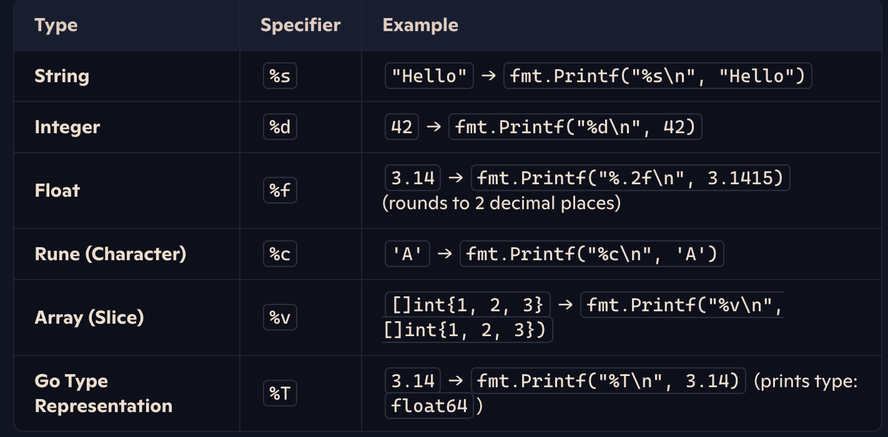

# Go Programming language

Learning Go Lang Path

### Basic Structure

- [x] Syntax (loops, variables, functions, conditions)
- [ ] Advanced Sytax (struct, interfaces, pointers)
- [ ] Explore Concurrency (goroutines, channels)

#### Variables

- Documentation [variables](syntax/variables.md)

Lambda functions

```go
func main() {
  multiply := func(a, b int) int {
    return a*b
  }

  fmt.Println(multiply(3,4))
}

```

<b>PrintF</b> Values



<b>Structs</b>

```go
type Person struct {
  name string
  age number
}

// embeded struct
type Employee struct {
  Person
  company string
}
```

attach function to struct

- directly
- with pointers

```go

func (p Person) greet() {
  fmt.Println("Wussup ", p.name)
}

-------------------------------

func (p *Person) increaseAge() {
  p.age++
}

```

### Projects

- [ ] Build cli
- [ ] File handling
